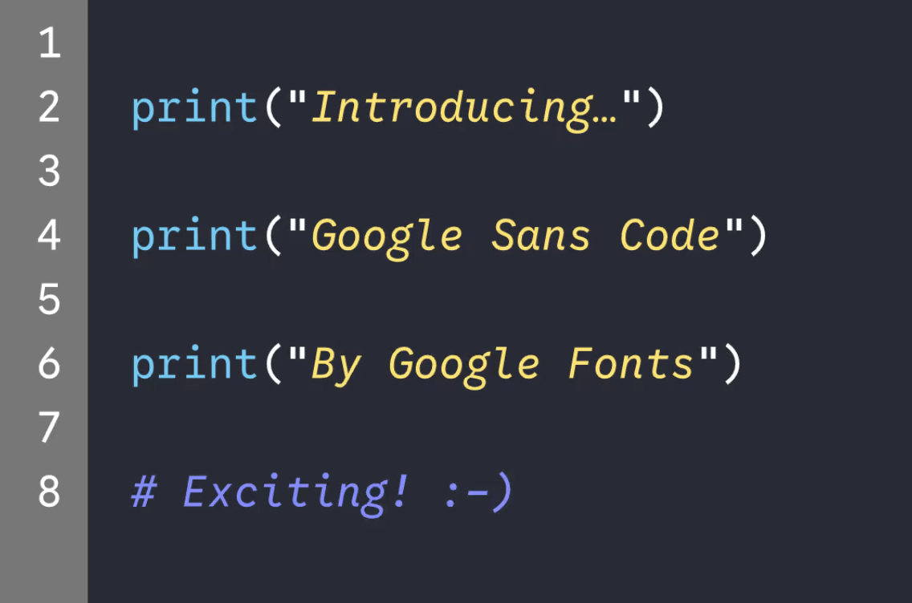

# Google Sans Code

### In Memory of Chris Simpkins

Dedicated to the memory of Chris Simpkins, whose enthusiasm and efforts were foundational to this project.

## About



Google Sans Code is a fixed-width font family, designed to bring clarity, readability, and a bit of Google's distinctive brand character to code. Stemming from Google's brand type design aesthetic and developed for products like Gemini and Android Studio, it ensures each character remains distinct, even at small sizes. Moreover, it's finely tuned for the unique typographic demands of programming language syntax.

Explore the [features](#features), learn where to [download the fonts](#installation), or dive into the [build instructions](#build-instructions) to compile them yourself below.

## Features

- **Enhanced Legibility:** Designed for optimal readability in code editors and terminals.
- **Supported Scripts:** Extended Latin, with support for multiple languages.
- **Variable Font:** Offers a wide weight axis range from 300 to 800.
- **OpenType Features:** Stylistic sets, localized forms
- **Variable Font Axes:**
  - `wght`: weight, range 300 - 800; default=400

## Installation

To install Google Sans Code, download [the latest variable font release files](https://github.com/googlefonts/googlesans-code/releases/latest) and install the fonts on your operating system.  The download zip archive includes separate Roman and Italic variable fonts.

## Build Instructions

### Install Dependencies

This project is compiled from glyphspackage format source files to TTF format variable font binaries using the [`fontc` font compiler](https://github.com/googlefonts/fontc). The fontc compiler project is in active development and we recommend that you use the same release version of the `fontc` compiler that we are using to compile our repository releases.

You may identify the version of the fontc compiler version that we use at any commit in this repository by reviewing our GitHub Action workflow configuration file for that commit, and locating the `cargo binstall fontc` definition that includes the fontc executable version number after the `@` symbol.

Download the appropriate [fontc compiler release](https://github.com/googlefonts/fontc/releases) for your platform/architecture, install it on your system, and use the build instructions below.

### Build

Clone the repository to your local machine:

```shell
git clone https://github.com/googlefonts/googlesans-code.git
```

and then navigate to the root of the repository directory.

Compile the Roman variable font:

```shell
fontc sources/GoogleSansCode.glyphspackage --flatten-components --decompose-transformed-components --output-file fonts/variable/GoogleSansCode[wght].ttf
```

Compile the Italic variable font:

```shell
fontc sources/GoogleSansCode-Italic.glyphspackage --flatten-components --decompose-transformed-components --output-file fonts/variable/GoogleSansCode-Italic[wght].ttf
```

The compiled fonts are available in the sub-directory: `fonts/variable`.

## Continuous Integration and Deployment (CI/CD)

On each push to the `main` branch, and on all Pull Request branch commit pushes, the fonts are compiled and tested with our quality assurance test suite. The compiled TTFs and QA testing reports can be downloaded from the Actions tab, in the Summary page of the latest run.

When a git tagged version release is created on GitHub, release fonts are uploaded to the respective [release](https://github.com/googlefonts/googlesans-code/releases).

## Contributing

Please open new issue reports on [our repository issue tracker](https://github.com/googlefonts/googlesans-code/issues).

See the [CONTRIBUTING.md](/CONTRIBUTING.md) file for additional contributing instructions.

## Changes

See the [CHANGELOG.md](CHANGELOG.md) for details on recent changes.

## License
This Font Software is licensed under the SIL Open Font License, Version 1.1. This license is available with a FAQ at [https://openfontlicense.org](https://openfontlicense.org)

See [AUTHORS.txt](/AUTHORS.txt) for a list of copyright authors, including organizations like Google LLC.
See [CONTRIBUTORS.txt](/CONTRIBUTORS.txt) for a list of individual people who have contributed.

Also see [TRADEMARKS.md](/TRADEMARKS.md) regarding naming issues.

